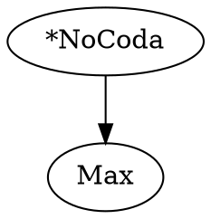

# OTSoft Graph Visualization: Requirements and Technology

## Overview

The original OTSoft generates **Hasse diagrams** — directed acyclic graphs (DAGs) that visualize constraint ranking relationships. This document captures the requirements for porting that functionality to the web frontend.

There are **no other chart types** in OTSoft. Bar charts, line graphs, and scatter plots are not needed.

---

## What Is a Hasse Diagram?

A Hasse diagram displays a partial order over constraints:

- **Nodes**: one per constraint, labeled with its abbreviation
- **Directed edges** (arrows): an edge from constraint A to constraint B means "A dominates B"
- **Edge styles**: solid or dotted, sometimes labeled

The graph is laid out top-to-bottom: higher-ranked constraints appear above lower-ranked ones. GraphViz's `dot` layout engine produces this automatically.

---

## Two Variants

### 1. FRed Hasse Diagrams (categorical algorithms: RCD, BCD, LFCD)

Generated by `Fred.bas:PrepareHasseDiagram()`.

Each pair of constraints (A, B) is classified from the FRed ERC basis:

| Classification | Condition | Edge style |
|---|---|---|
| **Certain** | Exactly one W in ERC | Solid arrow, no label |
| **Disjunctive** | More than one W in ERC | Dotted arrow, labeled `"or"` |
| **No argument** | No ERC covering this pair | No edge |

Example DOT output:


### 2. GLA/Stochastic OT Hasse Diagrams (probabilistic algorithms)

Generated by `boersma.frm:PrintPairwiseRankingProbabilities()`.

Each pair of constraints is assigned a probability based on the difference in learned ranking values, looked up in a pre-computed table of 443 threshold/probability pairs.

| Condition | Edge style |
|---|---|
| P ≥ 0.95 | Solid arrow with probability label |
| P < 0.95 | Dotted arrow with probability label |
| Adjacent strata, P > 0.999 | Solid arrow labeled `"1"` |

---

## Export Formats

The VB6 original exported:
- `[filename]Hasse.txt` — GraphViz DOT source (intermediate)
- `[filename]Hasse.gif` — Rendered image (via `dot.exe`)
- Embedded GIF in HTML output via `` tag

The web version will export:
- **SVG** — vector, lossless, scalable
- **PNG** — raster, compatible with all contexts
- The DOT source string will be included in the downloadable text output (matching VB6's `.txt` intermediate file)

---

## Technology Choice: `@viz-js/viz`

**Selected library:** [`@viz-js/viz`](https://www.npmjs.com/package/@viz-js/viz) — GraphViz compiled to WebAssembly.

### Rationale

| Criterion | `@viz-js/viz` | dagre + custom SVG | D3.js |
|---|---|---|---|
| Layout fidelity | Identical to original (same GraphViz engine) | Similar but not identical | Manual implementation |
| Implementation effort | Minimal — pass DOT string, receive SVG | Moderate — build graph, render SVG | High — everything from scratch |
| Edge labels & styles | Built-in via DOT syntax | Must implement manually | Must implement manually |
| SVG export | Native output format | Possible | Possible |
| PNG export | Via canvas conversion | Via canvas conversion | Via canvas conversion |
| Bundle size | ~1.6 MB WASM (lazy-loaded) | ~30 KB | ~250 KB |
| Browser support | All modern browsers (WASM) | All browsers | All browsers |
| Maintenance status | Active — v3.24.0, updated Dec 2025 | @dagrejs/dagre: moderate | Very active |

### Key Advantages

1. **Logical fidelity**: the Rust code generates a GraphViz DOT string (matching VB6's `Hasse.txt`), and viz.js renders it with the exact same GraphViz layout engine. No re-implementation of layout algorithms needed.

2. **Simplicity**: `viz.renderSVGElement("digraph G { ... }")` returns a DOM element ready to display.

3. **Lazy-loading**: viz.js WASM is only downloaded when the user views a Hasse diagram. The 1.6 MB cost is not paid at page load.

4. **Consistent with project architecture**: the project already uses WASM for the core ot-soft module, so loading a second WASM module is a well-understood pattern.

5. **University compatibility**: WASM is supported in all modern browsers including Chrome, Firefox, Safari, and Edge. No plugin or extension required. University-managed browsers will support it.

---

## DOT Generation

DOT strings are generated in Rust (in `rust/src/hasse.rs`) and exposed as WASM exports. This keeps all computation in Rust per project principles.

### FRed DOT generation

```rust
pub fn fred_hasse_dot(valhalla: &[&str], abbrevs: &[&str]) -> String
```

Algorithm (porting `Fred.bas:PrepareHasseDiagram`):
1. For each ERC in the Valhalla:
   - Count W's: 1 W → Certain ranking; >1 W → Disjunctive
2. Build a `ranking_array[i][j]` (Certain / Disjunctive / None)
3. Emit DOT: nodes with `label=abbrev, fontsize=14`; edges with `fontsize=11`, dotted+`label="or"` for disjunctive

### GLA DOT generation

```rust
pub fn gla_hasse_dot(ranking_values: &[f64], abbrevs: &[&str]) -> String
```

Algorithm (porting `boersma.frm:PrintPairwiseRankingProbabilities`):
1. Sort constraints by descending ranking value
2. For each ordered pair (i, j) where i < j in sorted order:
   - Compute `diff = ranking_values[i] - ranking_values[j]`
   - Look up probability in threshold table (443 entries)
   - If found: emit edge with probability label; dotted if P < 0.95
   - If not found (very high): if adjacent strata, emit edge with label `"1"`

---

## Web Component Design

```
web/src/components/HasseDiagram.tsx
```

- Accepts `dotString: string` prop
- Lazy-loads `@viz-js/viz` instance on first render (cached for reuse)
- Renders SVG inline in the page
- Provides two export buttons: **Download SVG** and **Download PNG**
- PNG export: render SVG to an offscreen `<canvas>`, call `canvas.toDataURL("image/png")`
- Shows a loading indicator while viz.js WASM initializes (~200 ms first load)

Integration points:
- `RcdPanel.tsx`: show Hasse diagram after FRed results (when FRed is enabled)
- `GlaPanel.tsx`: show Hasse diagram after GLA results (Stochastic OT mode only)
