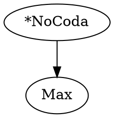

# OTSoft Output Files

This document describes all output files generated by OTSoft, based on the VB6 source code.

## Output Directory

All output files are written to a folder alongside the input file, named after the input file.

## Common Output Files

These files are generated by most algorithms:

| File | Description |
|------|-------------|
| `DraftOutput.txt` | Quick text output for screen viewing |
| `QualityOutput.txt` | Formatted for Word macro conversion (includes formatting codes) |
| `ResultsFor[filename].htm` | HTML output with CSS-styled tableaux |
| `TabbedOutput.txt` | Tab-delimited output for Excel/spreadsheet import |

### HTML Output

HTML tableaux are generated by `PrintTableaux.bas` with:
- CSS-styled tables with borders
- Configurable shading for harmonically-dominated cells (grayness 1-100, default 50)
- Exclamation marks (`!`) at decision points where a constraint eliminates a candidate
- Optional pointing-finger symbol for winners
- Constraints sorted by rank, candidates sorted by harmony

### HTML Options

| Option | Default | Description |
|--------|---------|-------------|
| Grayness | 50 | Shading darkness (1=white, 100=black) |
| Custom color | — | Direct HTML color code instead of gray |

## Categorical Algorithm Outputs

### Ranking Documentation

| File | Generated by | Description |
|------|-------------|-------------|
| `HowIRanked[filename].txt` | RCD, BCD, LFCD | Step-by-step log of the ranking process |

This file documents each stratum's construction: which constraints were excluded (and why), which joined the stratum, and the final result (success or failure).

### Tableaux

Full tableaux can be printed showing:
- Constraints sorted by rank (highest-ranked leftmost)
- Candidates sorted by harmony (winner first)
- Shaded cells after the deciding constraint
- Exclamation marks at fatal violations
- Pointing finger (☞) for winners

### Mini-Tableaux

Generated by `PrintMiniTableaux.bas` for ranking arguments:
- Small 2×2 tableaux showing winner vs. one rival
- Only include constraints that distinguish the pair
- Shading at decision points
- Output in text, Word-format, and HTML

### Hasse Diagrams

Generated by FRed for visualizing constraint rankings:
- File: `[filename]Hasse.txt` (GraphViz DOT format)
- Rendered as `.gif` using GraphViz's `dot.exe`
- Solid arrows = certain rankings
- Dotted arrows with "or" = disjunctive rankings



### Sorted Input File

Optionally, `PrintTableaux.bas` can save a copy of the input file with constraints and candidates reordered by the computed ranking.

## Probabilistic Algorithm Outputs

### Main Output Format

The tabbed output includes predicted probabilities:

```
Input    Candidate    Freq    Target    Predicted    Con1    Con2    ...
         Weights:                                    w1      w2      ...
/input/  [cand1]      freq    obs%      pred%        v1      v2      ...
         [cand2]      freq    obs%      pred%        v1      v2      ...
```

### History Files

| File | Algorithm | Description |
|------|-----------|-------------|
| `History.txt` (or `.xls`) | GLA, NHG | Simple history: trial number + all ranking/weight values |
| `FullHistory.txt` (or `.xls`) | GLA, NHG | Detailed: trial + input + generated + observed + deltas + values |
| `HistoryOfCandidateProbabilities.txt` | GLA (MaxEnt mode) | Trial + all candidate probabilities |
| `HistoryOfWeights.txt` | Batch MaxEnt | Weights at each iteration |
| `HistoryOfOutputProbabilities.txt` | Batch MaxEnt | Predicted probabilities at each iteration |

### Persistence Files

| File | Description |
|------|-------------|
| `MostRecentRankingValues.txt` | Final ranking values (GLA) — can be used as initial values for next run |
| `MostRecentWeights.txt` | Final weights (MaxEnt, NHG) — can be used as initial values for next run |

## Factorial Typology Outputs

| File | Description |
|------|-------------|
| Main output | Summary of all output patterns, list of derivable candidates, complete listing with grammars |
| `[filename]FTSum.txt` | Tab-delimited: one row per output pattern, columns are input forms |
| `[filename]CompactSum.txt` | Collated patterns by distinct surface forms (ignoring input) |
| `[filename]TOrder.txt` | T-order implications: "if input1→output1 then input2→output2" |

### FTSum Format

```
/input1/    /input2/    /input3/
[out1]      [out2]      [out3]
[out1]      [out4]      [out3]
```

### CompactSum Format

```
3    [out1]    [out2]    [out3]
2    [out1]    [out4]
```

First column = number of distinct output forms in this pattern.

### T-Order Format

```
If this input    yields this output    then this input    yields this output
in1              out1                   in2                out2

For the following input-output pairs, no other candidate ever wins:
Input    Candidate
in1      out1

Nothing is implicated by these input-output pairs:
Input    Candidate
in3      out5
```

## Export Formats

### Praat Export

Generated by `SaveAs.bas` → `SaveAsPraat()`:

| File | Format | Description |
|------|--------|-------------|
| `[filename].OTGrammar` | Praat OTGrammar format | Constraint rankings, tableaux, and violations |
| `[filename].PairDistribution` | Praat PairDistribution format | Frequency data for learning |

### R Export

Generated by `SaveAs.bas` → `SaveAsR()`:

Tab-delimited file for logistic regression analysis in R, with columns for constraint violations and frequency data.

## Configuration Files

These files store user preferences, not algorithm output:

| File | Description |
|------|-------------|
| `OTSoftAuxiliarySoftwareLocations.txt` | Paths to external software (Excel, Paint, GraphViz) |
| `OTSoftRecentlyOpenedFiles.txt` | Recently opened file list |
| `OTSoftRememberUserChoices.txt` | Persisted user preference choices |
| `CustomLearningSchedule.txt` | Custom plasticity schedule for online learners |
| `ModelParameters.txt` | Custom initial values, mu/sigma for Gaussian prior |
